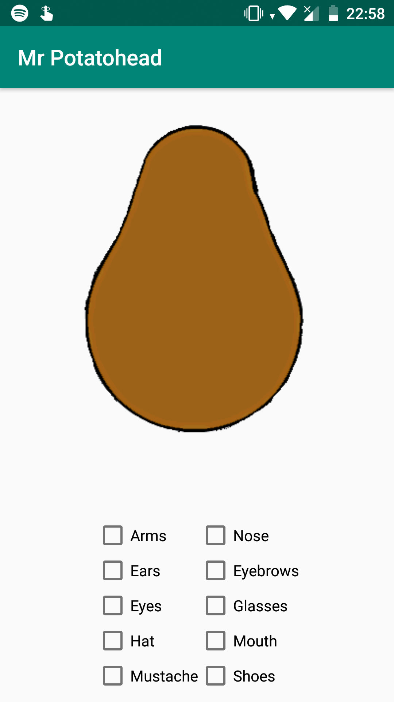
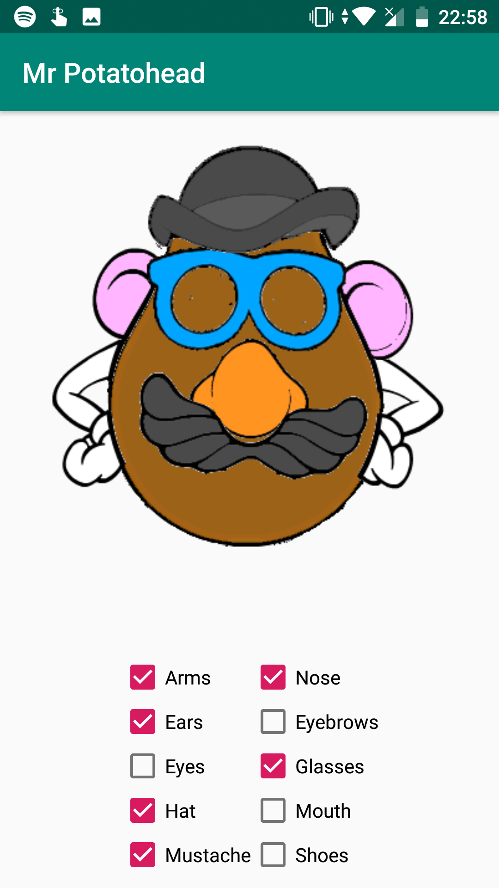
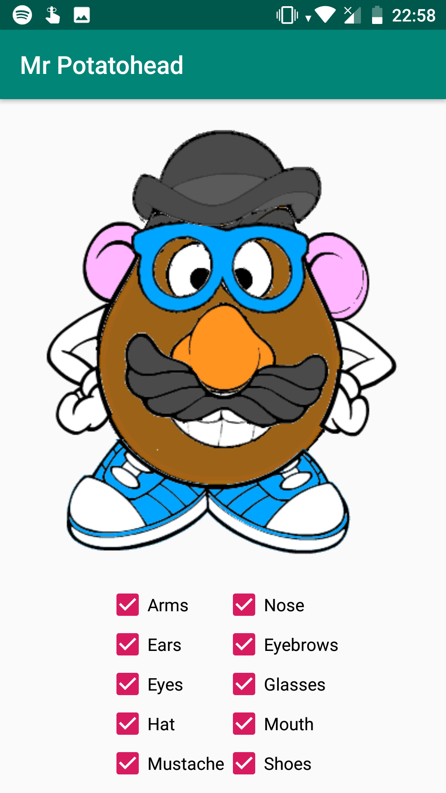
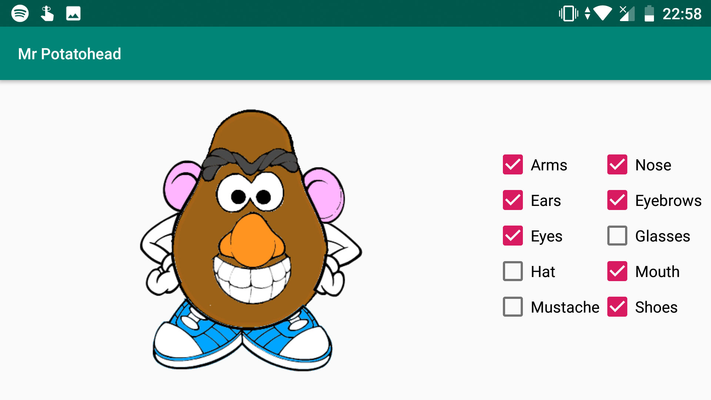

# Mr-Potatohead

## Author info
**Name:** Stefan Klut  
**Studentnumber:** 11331720  
**email:** stefanklut12@gmail.com

## Description
This is an app that virtually recreates the beloved childrens toy "Mr Potatohead". 
The interface is a picture of the standard body of the "Mr Potatohead" with checkboxes underneath that add or remove the body parts.
The checkboxes are linked to a java program that can toggle the visiblity of the images that the "Mr Potatohead" is made out of.

## Screenshots

### Opening Screen:

### Some boxes checked:

### All boxes checked:

### Landscape mode:

      
